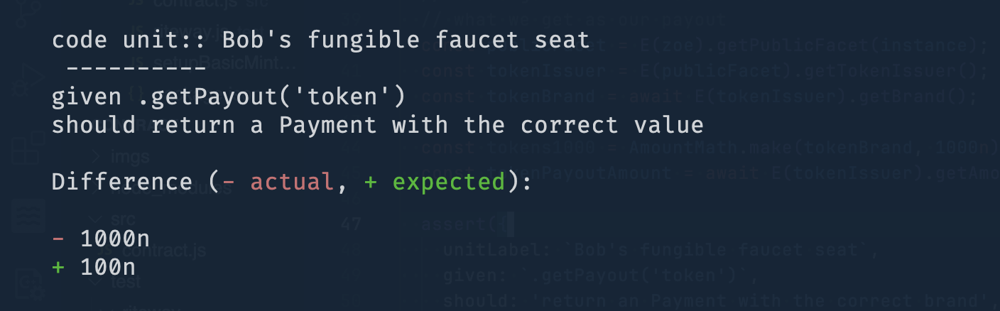

# agoric-riteway
Custom implementation of [riteway](https://github.com/parraleldrive/riteway) built to work with the ava testing framework. The purpose of this library is to make developers write more explicit test cases that read like a useful bug report when failing!

### Additional Features
* `unitLabel` property can be used to specify 

